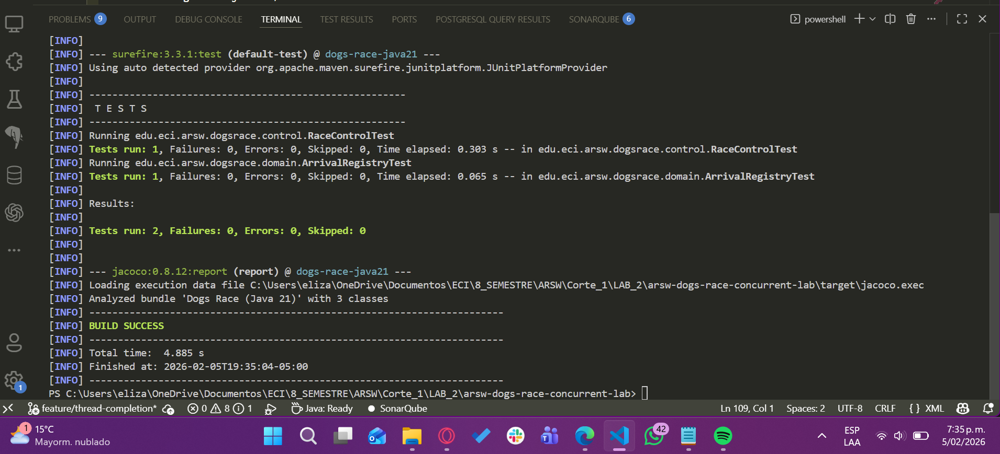
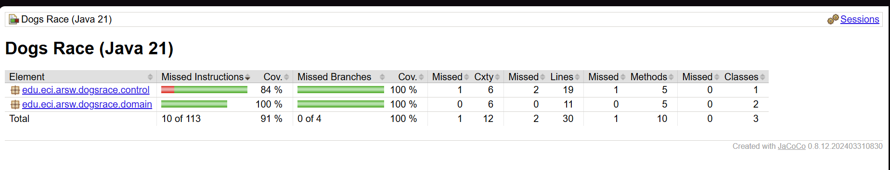
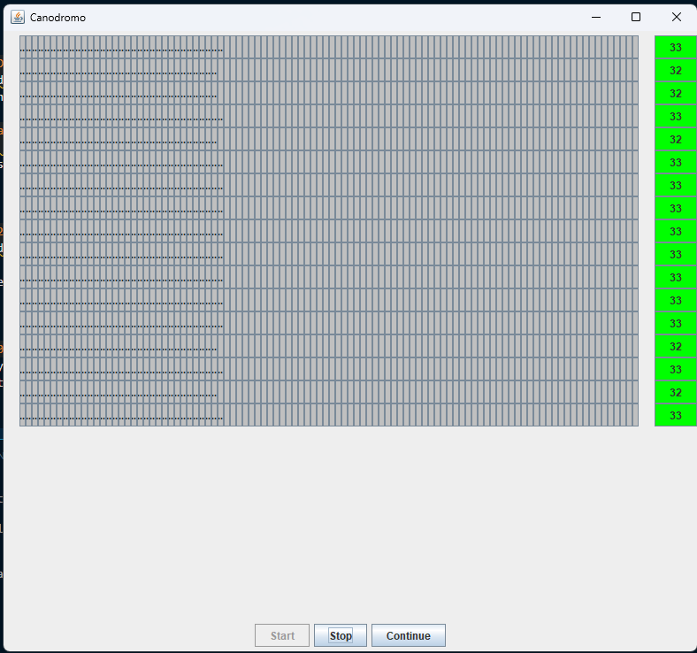
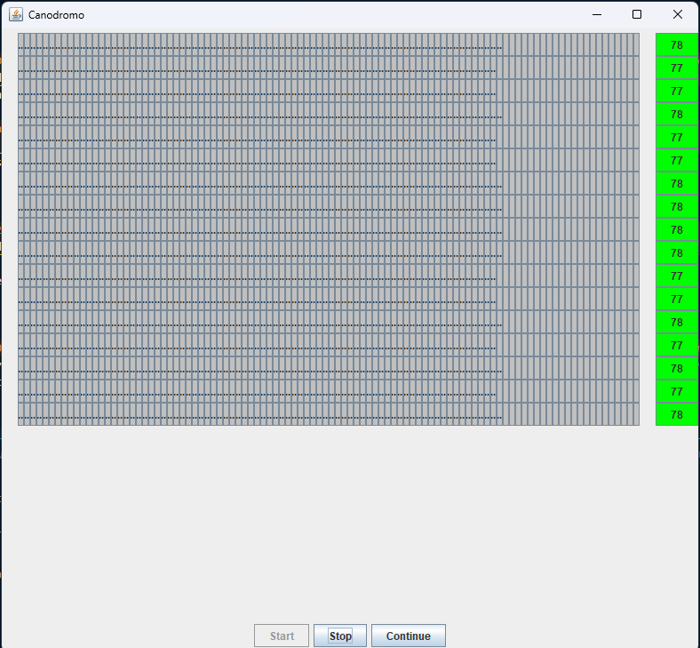
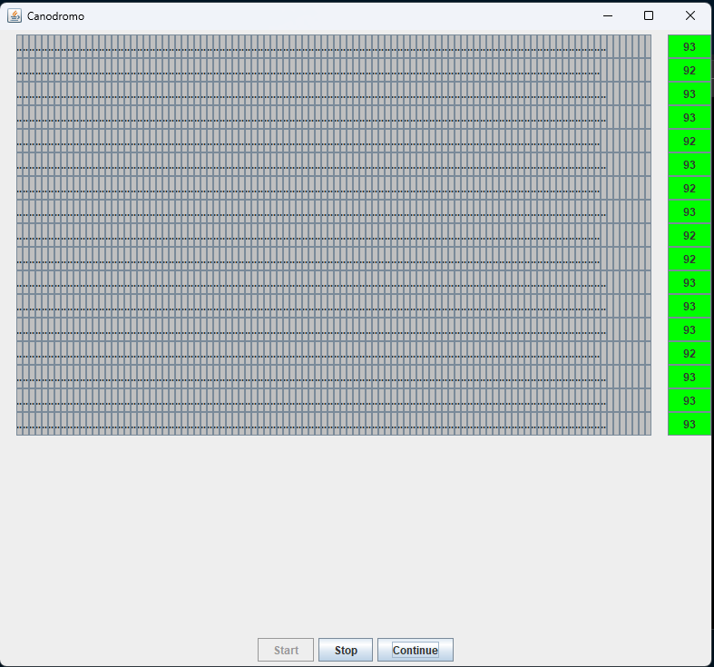
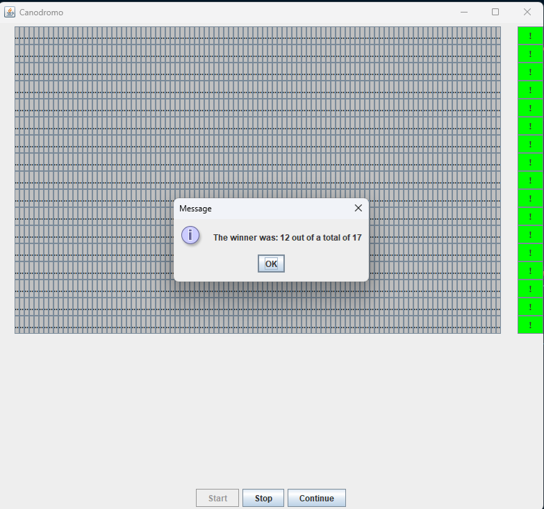
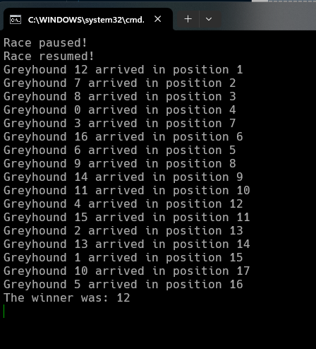
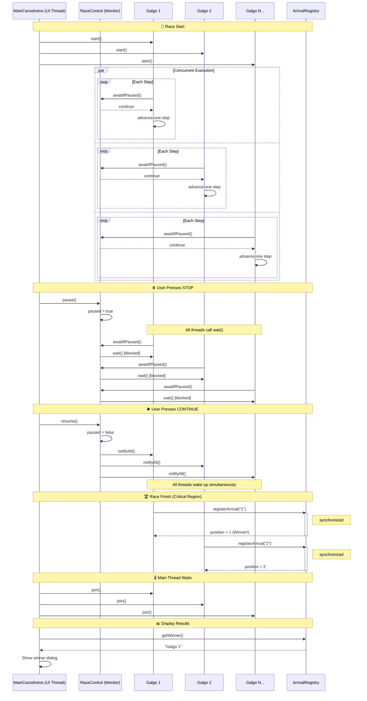

# 🐕 Lab 2 – Concurrent Programming: Greyhound Race

## Software Architecture (ARSW)

### Objective
The objective of this lab is for the student to **analyze, fix, and design a concurrent solution**, identifying **synchronization problems**, **critical regions**, and applying **appropriate concurrency control mechanisms** in Java.

The exercise is based on a simulation of a **greyhound race**, where each greyhound runs as an independent thread and advances through a lane until completing the track.

---

## Problem Context
In the simulation:

- Each **greyhound** runs concurrently (one thread per greyhound).
- All greyhounds share an **arrival registry**.
- The system allows **starting**, **stopping**, and **resuming** the race.
- At the end of the race, the **arrival order (ranking)** must be displayed consistently.

The application initially presents **synchronization problems** that must be analyzed and fixed.

---

## General Project Structure

The project follows a **layer separation**, consistent with the previous lab:

```
src
 ├── main
 │   └── java
 │       └── edu.eci.arsw.dogsrace
 │           ├── app        -> Entry point and orchestration
 │           ├── threads    -> Execution threads (greyhounds)
 │           ├── control    -> Concurrent execution control
 │           ├── domain     -> Model and shared state
 │           └── ui         -> Graphical interface
 └── test
     └── java
         └── edu.eci.arsw.dogsrace
```

---

## Activities to Develop

### 1️⃣ Thread Completion Synchronization
Fix the application so that the results notification is displayed **only when all greyhound threads have finished their execution**.

**Hints:**
- The action to start the race and display results is performed from `MainCanodromo`.
- You can use the `join()` method of the `Thread` class.

### 🛠️**Solution**

#### *Problem*
The application was displaying results **before all greyhound threads had finished execution**, causing incomplete or incorrect rankings to be shown prematurely.

#### *Root Cause*
The main orchestration logic in `MainCanodromo` was calling the results display immediately after initiating all greyhound threads, without establishing a synchronization mechanism to ensure all concurrent executions had completed.

#### *Solution Implemented*
We integrated the **`join()` method** from the Java threading API to enforce **thread-level synchronization**:

**Key Implementation Details:**

- **In `MainCanodromo.java`**: After starting all greyhound threads, we added an explicit **join synchronization phase** where the main thread waits for each greyhound thread to complete.
- **How it works**: The `join()` method blocks the main thread's execution until the associated greyhound thread finishes its run, ensuring a **happens-before relationship** between thread completion and result display.
- **Sequential guarantee**: Only after all greyhounds have completed their concurrent execution does the application proceed to calculate and display the final ranking.

#### *Why This Works*
The `join()` method provides an **implicit mutual exclusion** at the thread orchestration level by forcing the main thread to synchronize with worker threads, preventing any premature result computation while races are still ongoing.

#### *Result*

>**Consistent and reliable ranking display**: Results are now guaranteed to show the correct final positions of all greyhounds without race condition artifacts.


---


### 2️⃣ Identification of Inconsistencies and Critical Regions
Run the application multiple times and identify **inconsistencies in the ranking**.

**Tasks:**
- Identify the critical regions.
- Explain why they generate inconsistencies.
- Synchronize only those regions.

### Problem Identification

#### Race condition observed

When running the program **without synchronization**, the following issues occur when multiple dogs finish simultaneously:
1. **Duplicate positions**: Multiple dogs receive the same finishing position (e.g., two dogs both get position 2)
2. **Incorrect winner**: The dog declared as winner might not be the actual first finisher
3. **Lost position updates**: The final count of positions doesn't match the number of dogs

### Why this happens
The root cause is the **non-atomic increment** operation in `ArrivalRegistry.registerArrival()`:

```java
int position = nextPosition++;  // This is actually 3 operations:
                                // 1. Read nextPosition
                                // 2. Add 1
                                // 3. Write back
```

When multiple threads execute this simultaneously, they can:
- Read the same value
- Increment independently  
- Overwrite each other's results

**Example Timeline:**
```
Thread A reads nextPosition=5
Thread B reads nextPosition=5
Thread A writes nextPosition=6
Thread B writes nextPosition=6  ← Lost update! Should be 7
```

---

### Critical Regions Identified

The critical region is in `ArrivalRegistry.registerArrival()`:

```java
// CRITICAL REGION - Must be atomic
int position = nextPosition++;  // Shared state: position counter
if (winner == null) {           // Shared state: winner
    winner = dogName;           // Writing shared state
}
```

**Why is this critical?**
- Multiple `Galgo` threads call this method concurrently (all dogs finish around the same time)
- All threads access the **same shared variables** (`nextPosition`, `winner`)
- Operations involve **read-modify-write** sequences that must be atomic

**What is NOT critical?**
- The race execution in `Galgo.run()` - each dog runs independently
- Reading the final results in `getWinner()`/`getLastPosition()` - happens after all threads finish

---

### Synchronization Strategy

#### Solution Implemented
Synchronized the **entire** `registerArrival()` method:

```java
public synchronized int registerArrival(String dogName) {
    int position = nextPosition++;
    
    if (winner == null) {
        winner = dogName;
    }
    
    return position;
}
```

#### Why This Approach?
- **Mutex on `this`**: Uses the `ArrivalRegistry` instance as the lock
- **Minimal scope**: Only the arrival registration is synchronized, not the entire race
- **Correct granularity**: Each arrival registration is atomic, preventing interleaving
- **No deadlocks**: Single lock, acquired and released immediately

#### Alternative Considered
Could use `synchronized` blocks instead:

```java
public int registerArrival(String dogName) {
    int position;
    synchronized(this) {
        position = nextPosition++;
        if (winner == null) {
            winner = dogName;
        }
    }
    return position;
}
```

---

### Results After Synchronization

✅ **Fixed Issues:**
- Each dog receives a **unique, sequential position** (1, 2, 3, ..., 17)
- The **winner is always the first actual finisher**
- No lost updates or race conditions in arrival registration

✅ **Performance:**
- Minimal impact: Lock is held only during position assignment (~microseconds)
- Race execution itself remains fully concurrent
- No contention during the race, only at finish line

✅ **Thread Safety:**
- `ArrivalRegistry` is now thread-safe
- Can be safely called by multiple threads simultaneously
- Maintains correct state even under high concurrency
---

3️⃣ Pause and Continue Functionalities
Implement the **Stop** and **Continue** functionalities.

**Expected behavior:**
- **Stop**: all greyhounds suspend their execution.
- **Continue**: all greyhounds resume the race.

**Restrictions:**
- Use language synchronization mechanisms.
- Use a **common monitor**.
- Use `wait()` and `notifyAll()`.


### 🛠️**Solution**

#### *Problem*
The application needed the ability to pause and resume the race dynamically during execution, allowing all greyhound threads to suspend simultaneously and then continue running from where they left off, without losing their progress or causing inconsistencies.

#### *Root Cause*
The initial design lacked a centralized mechanism to coordinate the execution state of multiple concurrent threads, making it impossible to pause and resume all greyhounds in a synchronized manner.

#### *Solution Implemented*
We implemented a **common monitor pattern** using the `RaceControl` class as a centralized synchronization point:

**Key Implementation Details:**

- **In `RaceControl.java`**: Created a shared monitor object that manages the paused state using proper synchronization primitives:
  - **`pause()` method**: Sets a boolean flag to `true` within a synchronized block, signaling all threads to suspend.
  - **`resume()` method**: Sets the flag to `false` and calls `notifyAll()` to wake up all waiting threads.
  - **`awaitIfPaused()` method**: Uses a `while` loop with `wait()` to suspend threads when paused, preventing spurious wakeups.

- **In `Galgo.java`**: Each greyhound calls `control.awaitIfPaused()` at the beginning of each iteration in its run loop, creating a **synchronization checkpoint** that checks the race state before proceeding.

- **In `MainCanodromo.java`**: The Stop and Continue button action listeners simply invoke `control.pause()` and `control.resume()` respectively, providing a clean interface to control the race.

#### *Why This Works*
The **monitor pattern with `wait()/notifyAll()`** provides a robust mechanism for thread coordination:
- All greyhounds share the same monitor object, ensuring consistent state visibility.
- The `while` loop in `awaitIfPaused()` prevents race conditions by re-checking the condition after waking up.
- `notifyAll()` ensures that all waiting threads are awakened simultaneously when the race resumes.
- The synchronized blocks guarantee **mutual exclusion** and proper **memory visibility** across threads.

#### *Result*

>**Coordinated pause/resume behavior**: All greyhounds now suspend and resume execution simultaneously without losing race progress or causing thread safety issues, providing smooth and consistent race control.

---

### ✅ Test Results




---

### 📊 JaCoCo Coverage Analysis




---

## Evaluation Criteria

### Functionality
- Execution stopped and resumed consistently.
- Ranking without inconsistencies.

#### 📸 Evidence of Correct Execution

**Race Running** - All greyhounds advancing concurrently through their lanes:



**Race Paused** - All greyhounds suspended simultaneously after pressing Stop:



**Race Resumed** - All greyhounds continue from their previous positions after pressing Continue:



**Final Results** - Consistent ranking with unique positions (no duplicates):





---

### Design
- Synchronization only of critical regions.
- Reactivation with a single call using a common monitor.

#### 📊 Sequence Diagram: Thread Synchronization Flow

The following diagram illustrates how the synchronization mechanisms coordinate the greyhound threads:



#### Key Synchronization Points:

| Component | Mechanism | Purpose |
|-----------|-----------|---------|
| `RaceControl` | `wait()`/`notifyAll()` | Common monitor for pause/resume |
| `ArrivalRegistry` | `synchronized` method | Atomic position assignment |
| `MainCanodromo` | `join()` | Wait for all threads to complete |

---

## Deliverables
- ✅ Functional source code.
- ✅ Brief explanation of the critical regions and synchronization used.
- ✅ Evidence of correct execution.

---

## Final Remarks
This lab reinforces key concepts of **concurrent programming**, **correct synchronization design**, and **layered architecture**, which will be reused in subsequent labs.
